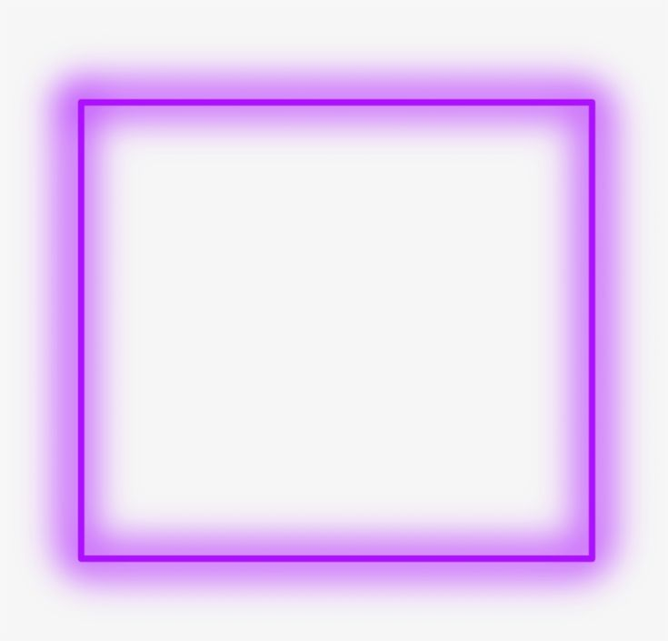
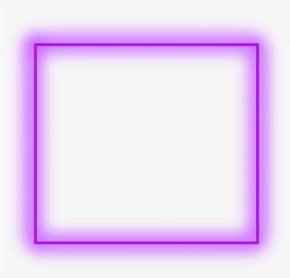
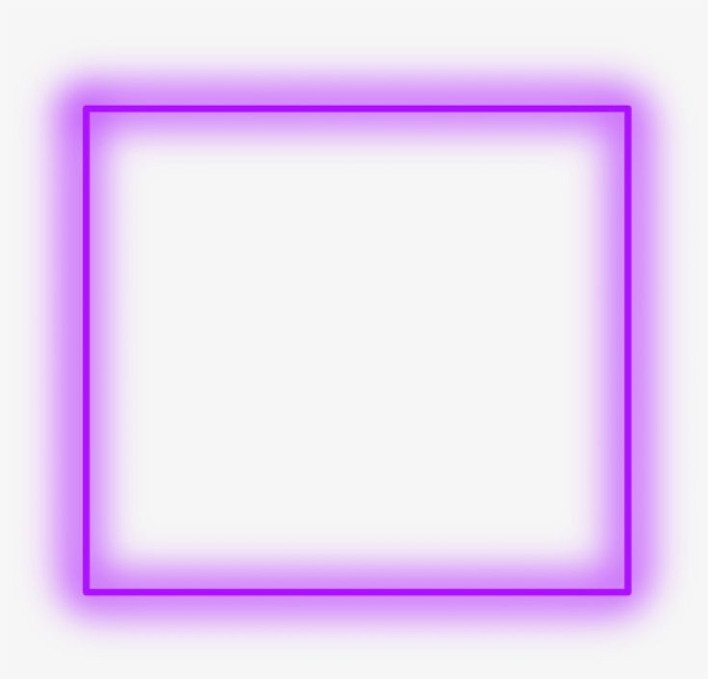
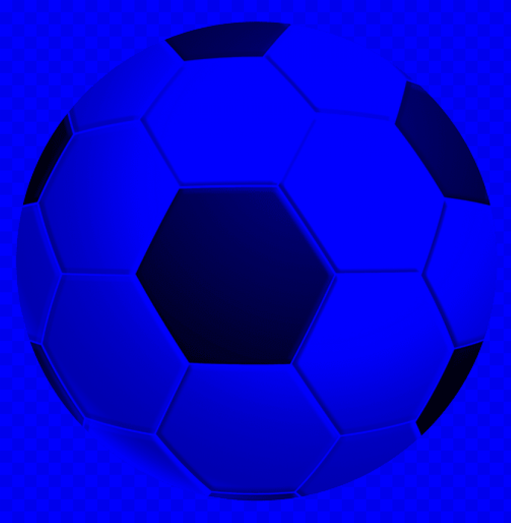

# Лабораторная работа №1. Цветовые модели и передискретизация изображений 

## Исходное изображение

## Задание 1:Растяжение изображения в M раз (M == 3)

## Задание 2: Сжатие изображения в N раз (N == 2)

 
## Задание 3: Передискретизация в К = М/N раз (M == 3, N == 2) через растяжение и последующее сжатие

## Задание 4: Передискретизация в К раз за один проход

## Исходное изображение для выделения цветов

## Задание 5: Выделение компонент R, G, B

## Задание 5: Выделение яркостной компоненты

## Задание 6: Инверсия яркостной компоненты

## Выводы
На примере изображений со спиралями видно, что при любой передискретизации объекты, обладающие круглыми формами,
подвергаются пикселизации. Так же проявляется эффект Муара (особенно заметен при сжатии).
При сравнении передискретизации в 1 и 2 прохода, можно утверждать, что при однопроходном преобразовании
изображение подвергается меньшей пикселизации.
