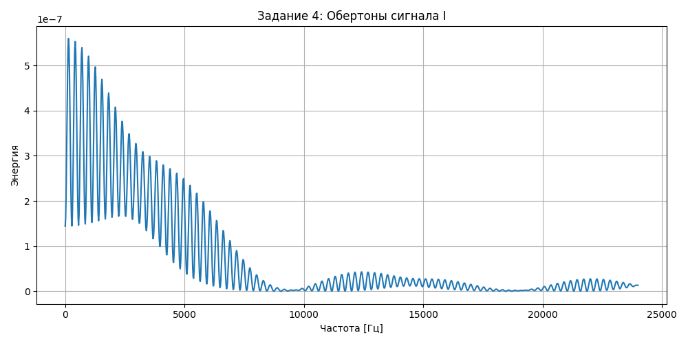

# Лабораторная работа №10. Обработка голоса 

## Образец собственного голоса для звука «А»

Форманты для А

1 - 538 Гц   
2 - 602 Гц   
3 - 1055 Гц   

## Образец собственного голоса для звука «И»

Форманты для И

1 - 187 Гц  
2 - 328 Гц  
3 - 468 Гц  

## Имитация собачьего лая

Форманты для ГАВ

1 - 473 Гц  
2 - 689 Гц  
3 - 904 Гц  