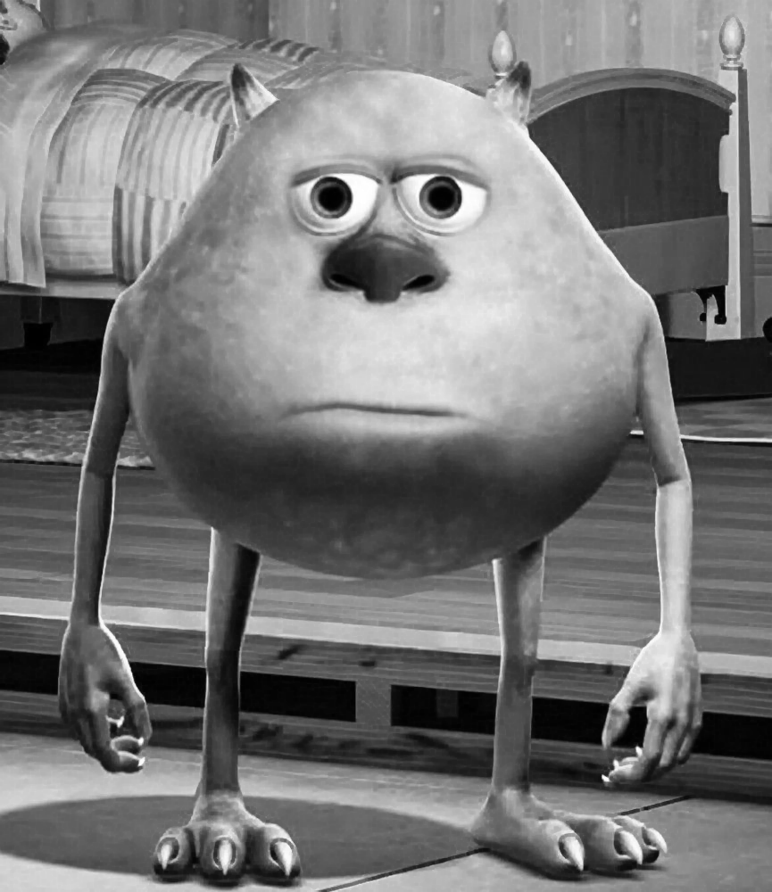
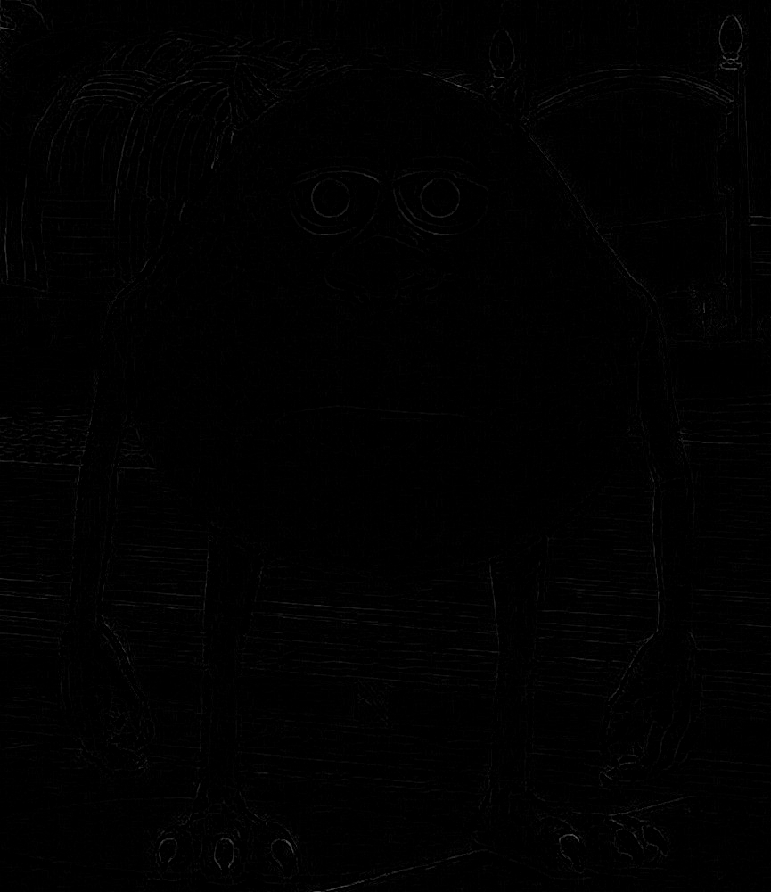
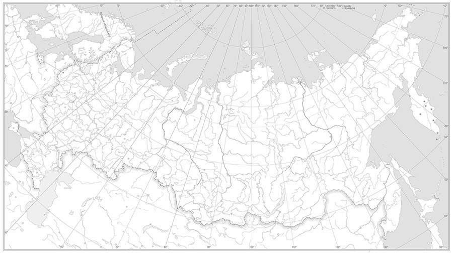
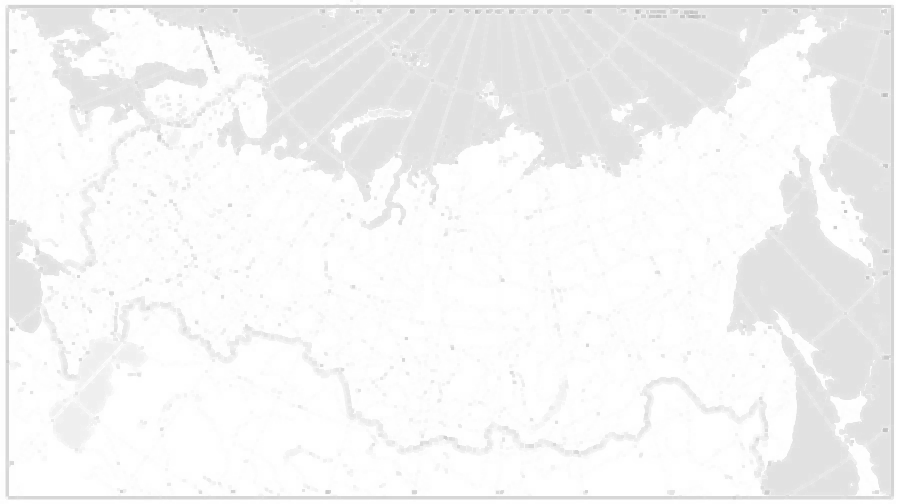
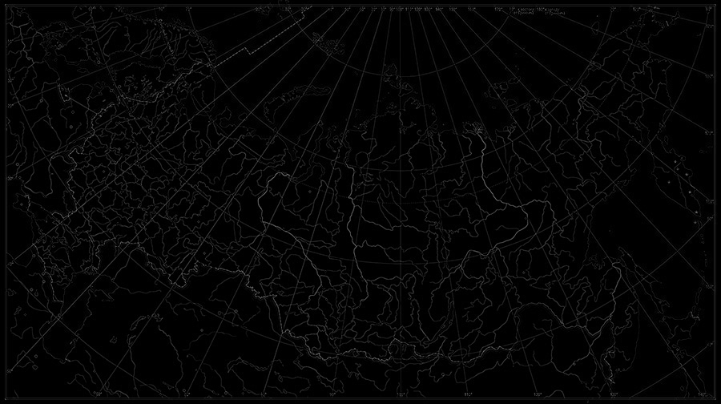
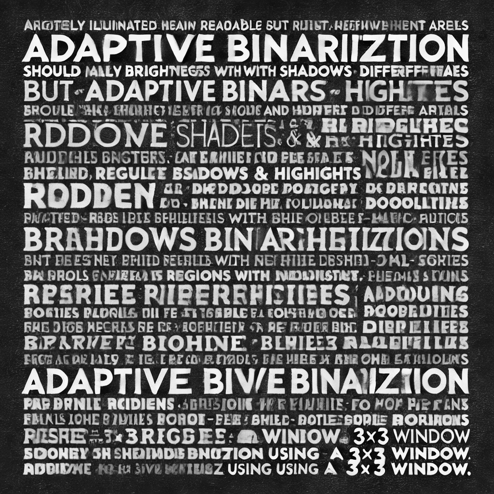
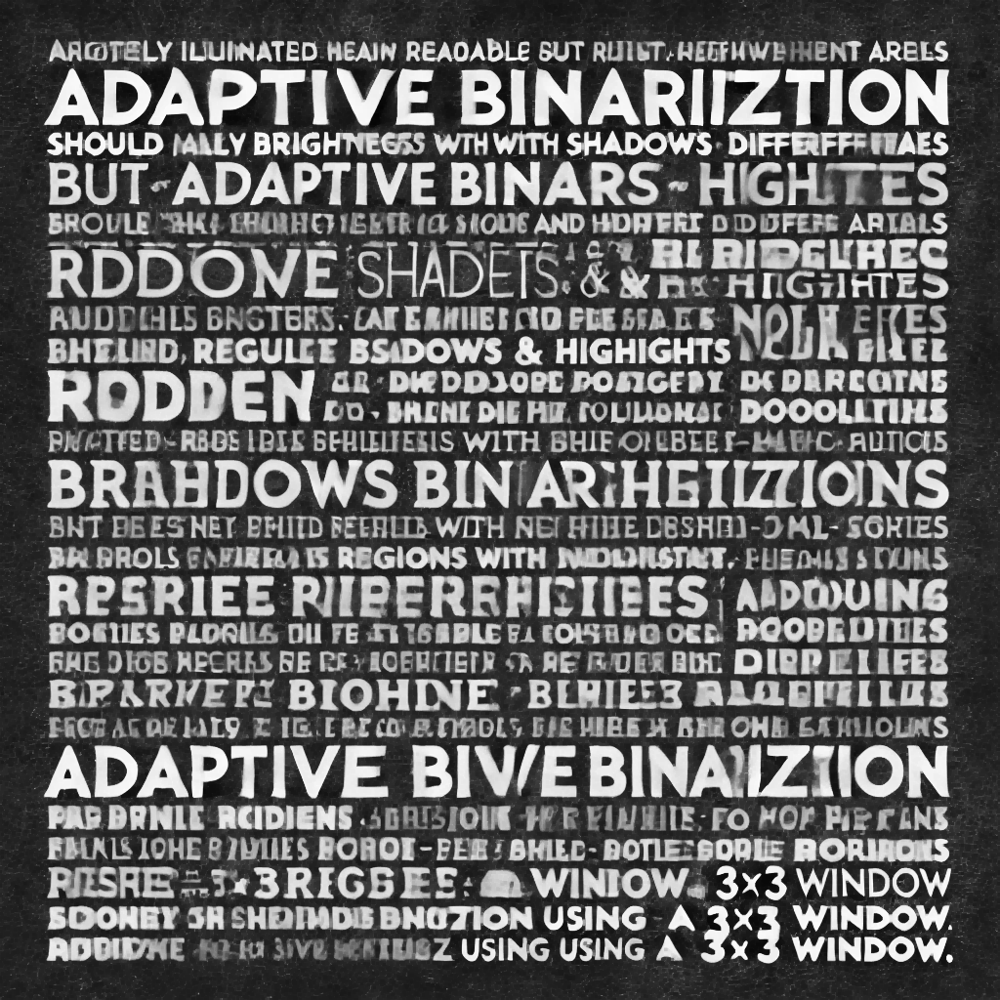
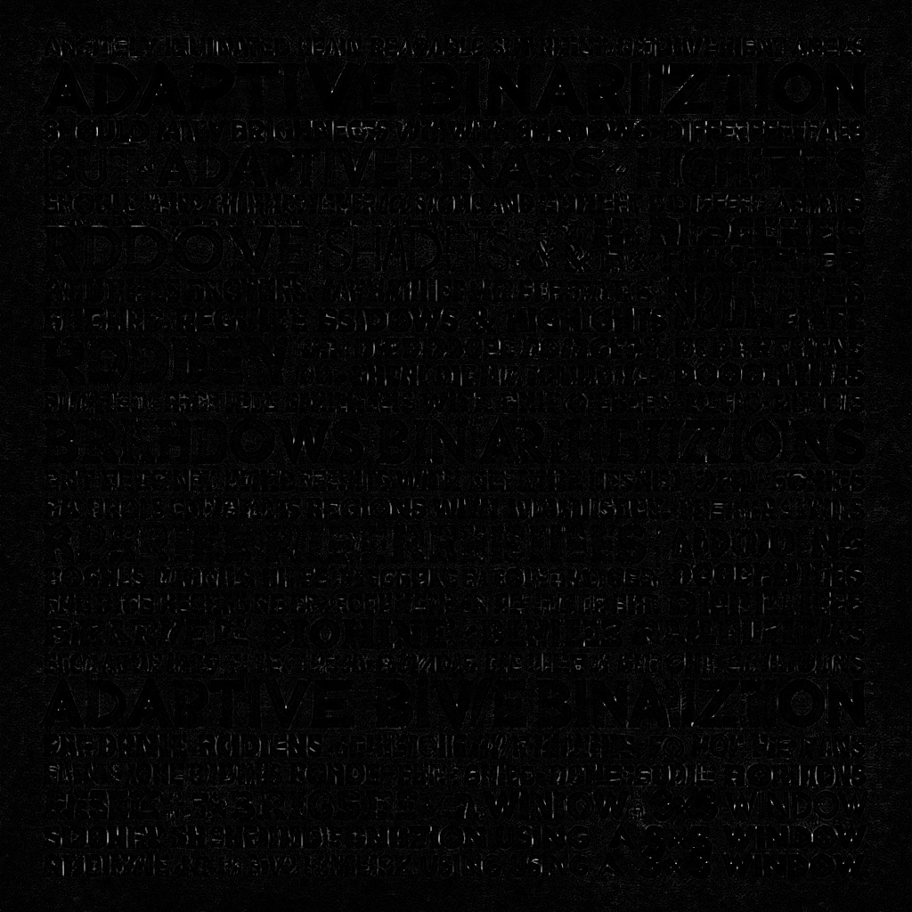

# Лабораторная работа №3. Фильтрация изображений и морфологические операции (Морфологическое закрытие Структурирующий элемент — квадрат) 

## Бинарное изображение мультика
Исходное изображение:

Морфологическое закрытие

Разность

## Бинарное изобаржение карты:
Исходное изображение:

Морфологическое закрытие

Разность

## Бинаризованное изображение человеческого лица
Исходное изображение:

Морфологическое закрытие

Разность

## Бинаризованное фото текста
Исходное изображение:

Морфологическое закрытие

Разность

## Выводы
В зависимости от характера изображения, мы можем судить подходит или не подходит ему морфологическое закрытие. 
Обычно лучшие результаты оно показывает на мультяшных изображениях и полутоновых, размывая изображения и убирая внешние 
дефекты, но оно плохо себя показывает на изображениях человеческого лица, убирая важные детали.
