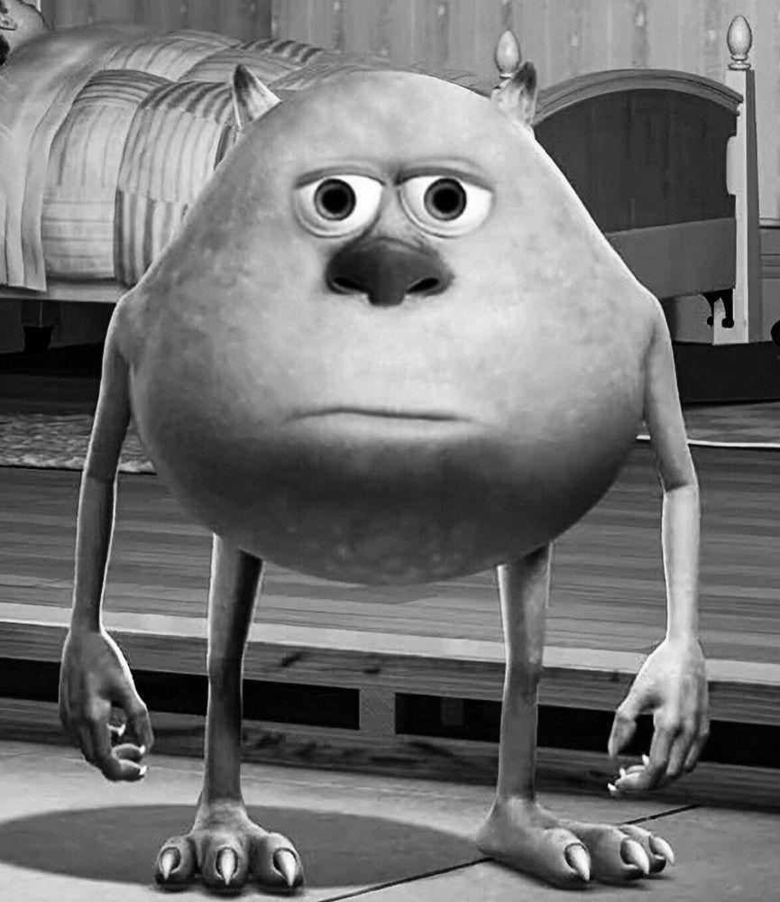
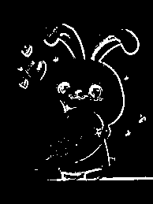

# Лабораторная работа №4. Выделение контуров на изображении.
Использовались Оператор Прюитт 3 × 3  и градиентная матрица $`G = |G_x| + |G_y|`$
## Кадр из мультфильма
Исходное изображение:

Градиент по Х:

Градиент по Y:

Градиентная матрица G:

Бинаризованная градиентная матрица G (Глобальная бинаризация, порог 40):

## Стикер
Исходное изображение:

Градиент по Х:

Градиент по Y:

Градиентная матрица G:

Бинаризованная градиентная матрица G(Глобальная бинаризация, порог 40):

## Выводы
Алгоритм выделения контуров оператором КрПрюиттуна хорошо себя показывает и качественно выделяет все границы