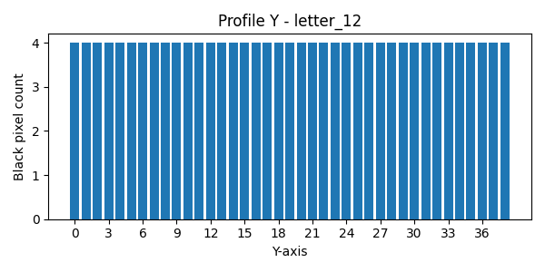
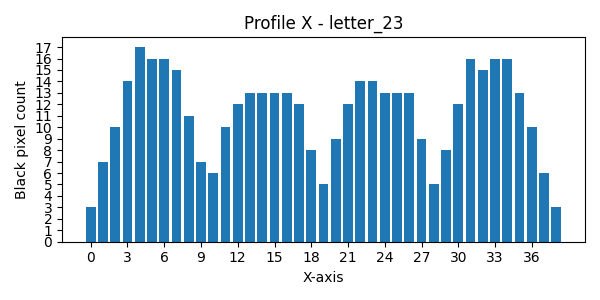

# Лабораторная работа №5. Выделение признаков символов.
Лабораторная работа проделывалась на английском алфавите. Тип букв -- обычные строчные,
шрифт TimesNewRoman, размер 52. В качестве демонстрации были выбраны 
5 символов. Квадраты для расчета веса черного расположены
следующим образом:

## Символ a
Прямое и инвертированное сгенерированные изображения:

Профили буквы:

Признаки:
1. Вес первого квадрата: 35
   1. Нормированный(на четверть площади) вес черного: 0.22727272727272727
2. Вес второго квадрата: 98
3. Нормированный(на четверть площади) вес черного: 0.5833333333333334
4. Вес третьего квадрата: 81
5. Нормированный(на четверть площади) вес черного: 0.525974025974026
6. Вес четвертого квадрата: 88
7. Нормированный(на четверть площади) вес черного: 0.5238095238095238
8. Центр масс: (13.026490066225165, 14.629139072847682)
9. Нормированный центр масс: (0.5663691333141376, 0.522469252601703)
10. Моменты инерции: (21884.463576158938, 14159.788079470196)
11. Нормированные моменты инерции: (27.913856602243545, 26.767085216389784)

## Символ g
Прямое и инвертированное сгенерированные изображения:

Профили буквы:

Признаки:
1. Вес первого квадрата: 106
2. Нормированный(на четверть площади) вес черного: 0.44166666666666665
3. Вес второго квадрата: 107
4. Нормированный(на четверть площади) вес черного: 0.44583333333333336
5. Вес третьего квадрата: 83
6. Нормированный(на четверть площади) вес черного: 0.3458333333333333
7. Вес четвертого квадрата: 128
8. Нормированный(на четверть площади) вес черного: 0.5333333333333333
9. Центр масс: (12.81132075471698, 18.827830188679247)
10. Нормированный центр масс: (0.5338050314465409, 0.47069575471698116)
11. Моменты инерции: (63200.431603773584, 26280.90566037736)
12. Нормированные моменты инерции: (39.50026975235849, 45.62657232704403)

## Символ I
Прямое и инвертированное сгенерированные изображения:

Профили буквы:

Признаки:
1. Вес первого квадрата: 38
2. Нормированный(на четверть площади) вес черного: 1
3. Вес второго квадрата: 38
4. Нормированный(на четверть площади) вес черного: 1
5. Вес третьего квадрата: 40
6. Нормированный(на четверть площади) вес черного: 1
7. Вес четвертого квадрата: 40
8. Нормированный(на четверть площади) вес черного: 1
9. Центр масс: (13.774834437086092, 22.95364238410596)
10. Нормированный центр масс: (0.375, 0.48717948717948717)
11. Моменты инерции: (19760.0, 195.0)
12. Нормированные моменты инерции: (12.991452991452991, 12.1875)

## Символ s
Прямое и инвертированное сгенерированные изображения:

Профили буквы:

Признаки:
1. Вес первого квадрата: 76
2. Нормированный(на четверть площади) вес черного: 0.6031746031746031
3. Вес второго квадрата: 43
4. Нормированный(на четверть площади) вес черного: 0.30714285714285716
5. Вес третьего квадрата: 34
6. Нормированный(на четверть площади) вес черного: 0.2698412698412698
7. Вес четвертого квадрата: 82
8. Нормированный(на четверть площади) вес черного: 0.5857142857142857
9. Центр масс: (9.051063829787234, 13.519148936170213)
10. Нормированный центр масс: (0.4763717805151176, 0.48282674772036477)
11. Моменты инерции: (19742.663829787234, 7283.387234042553)
12. Нормированные моменты инерции: (25.181969170646983, 20.17558790593505)

## Символ w
Прямое и инвертированное сгенерированные изображения:

Профили буквы:

Признаки:
1. Вес первого квадрата: 112
2. Нормированный(на четверть площади) вес черного: 0.42105263157894735
3. Вес второго квадрата: 115
4. Нормированный(на четверть площади) вес черного: 0.4107142857142857
5. Вес третьего квадрата: 104
6. Нормированный(на четверть площади) вес черного: 0.39097744360902253
7. Вес четвертого квадрата: 107
8. Нормированный(на четверть площади) вес черного: 0.3821428571428571
9. Центр масс: (18.929223744292237, 13.127853881278538)
10. Нормированный центр масс: (0.4853647113921086, 0.46885192433137635)
11. Моменты инерции: (26298.840182648404, 52456.805936073055)
12. Нормированные моменты инерции: (33.544439008480104, 34.48836682187578)