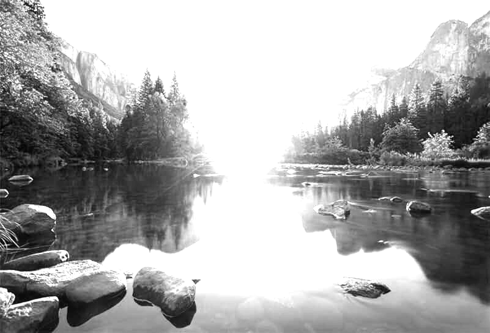

## Лабораторная работа №8. Текстурный анализ и контрастирование 

## Вариант 24

# Пример 1
Изображение, которое лучше всего подходит для линейного преобразования

# Исходное изображение

# Результат

# Анализ

# Текстурные признаки
До контрастирования (сумма HOG признаков): 2181678.00
После контрастирования (сумма HOG признаков): 5246879.00
min/max L: 0 106
min/max L_contrasted: 0 255

# Пример 2

# Исходное изображение
  

# Результат

# Анализ

# Текстурные признаки
До контрастирования (сумма HOG признаков): 16721733.00
После контрастирования (сумма HOG признаков): 16725143.00
min/max L: 1 255
min/max L_contrasted: 0 255

# Пример 3

Теперь возьмем то же самое изображение природы, но искусственно понизим яркость

# Исходное изображение

# Результат

# Анализ

# Текстурные признаки
До контрастирования (сумма HOG признаков): 13760289.00
После контрастирования (сумма HOG признаков): 23589096.00
min/max L: 1 150
min/max L_contrasted: 0 255